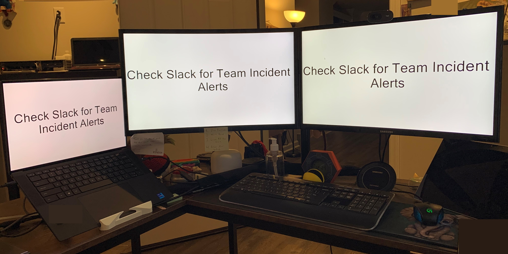

# Meeting Reminder Blackout
Meeting Reminder Blackout Tool written in PowerShell - Used for generating helpful reminders on a set schedule via Task Scheduler or your trigger of choice.

Customizable Text and reusable for as many different types of reminders you may need!

# Setup Instructions:
- Create a Directory at "C:\Jobs" (or any file path without spaces in it)
- Create a Sub-Directory in "C:\Jobs" called "ReminderApplication"
- Clone the code down and move it to "C:\Jobs\ReminderApplication"

# Creating a Reminder Instructions:
- Create a new reminder file at "C:\Jobs\" (for the sake of this guide we'll call it customReminder.bat)
- Paste the following code into the customReminder.bat
    - start /min "" "C:/Jobs/ReminderApplication/execute.bat" Check Slack for Team Incident Alerts

# Creating the Reminder Trigger via Task Scheduler:
- Press Start and type Task Scheduler
- On New Window - Right Click Task Scheduler Library Folder and click "Create Task"
- Use the following settings to create a reminder that will trigger every 15 minutes after login
    - General
        - Name - My Cool Reminder
    - Triggers
        - At Logon
        - Repeat task ever 15 minutes indefinitely
    - Actions
        - Start a program
            - %comspec% /c start "" /min "C:\Jobs\customReminder.bat"  ^& exit

# Screenshots

# How the File Directory Should Look

# How to Create The Task Scheduler Trigger

